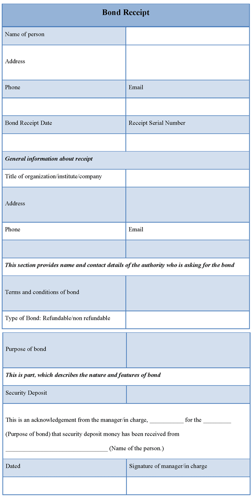
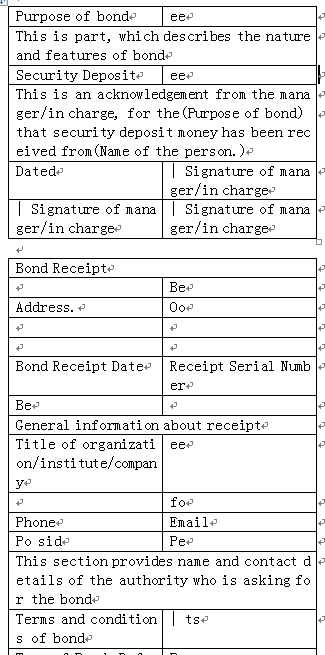
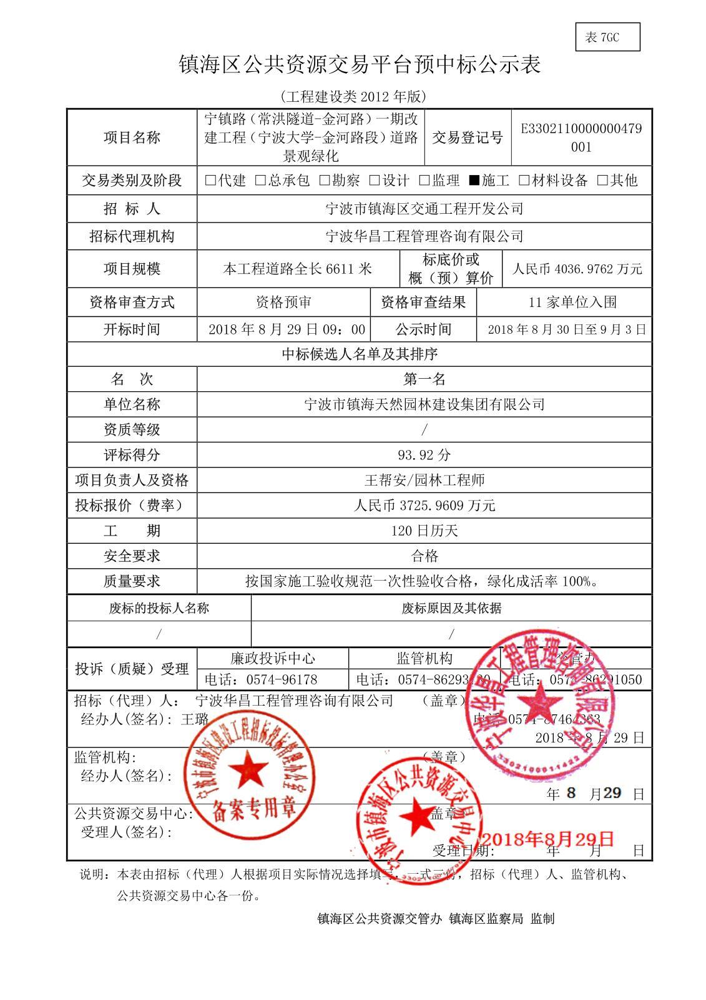
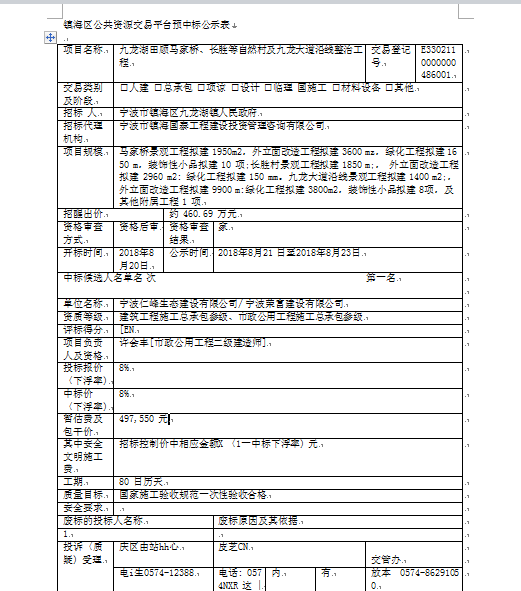

# OCR Table

[中文文档](README_CN.md)

## Introduction

For scanning copies containing tables or forms, many OCR softwares recognize text in entire page as whole by discarding all tables. Sometimes it is inconvenient for users. This project retains table structures as well and save the recognizing result as a Microsoft Word document.

This project consists of a DLL and an EXE, both of which are 64-bit. The subdirectory corresponding to DLL is tableocr, developed by Visual C++. It implements core functions, including table structure recognition and text recognition. the subdirectory corresponding to EXE is ocrtable, developed by C\#, which provides user interface. Below the pictures directory are sample scanning copies.

Suggestions are welcome. In addition to submitting an issue, you can email me as well. My email address is 31416\@msn.cn.

## Recognition Performance

[Download pre-compiled components](https://pan.baidu.com/s/1DOST4gu8Gr87McebLEpfgQ 56j9)

### English Character Recognition Example

Please do not select "Recognize simplified Chinese characters".

Scanning copy:

Result (Note that tables are not displayed in order)：

### Chinese Character Recognition Example

You need select "Recognize simplified Chinese characters".

Scanning copy：

Result:

Chinese character recognition relies on Tesseract official pre-training package, which supports only a few fonts. Users can consider training Tesseract mannually or using other OCR technologies instead.

## Development Environment

### DLL Development environment

Windows 7 SP1 x64

Visual Studio Community 2017

OpenCV 3.4.3

Tesseract 4.0.0-beta.4
（Compiled by Git source.  Please search online resources to learn how to setup Chinese character recognition.）

For the convenience of debugging, the DLL module includes Debug EXE configuration, which outputs EXE. The program displays table structures and outputs recognized text by OutputDebugString Windows API. Note that recognition process may take long time, and the popup window needs to be closed by keyboard instead of mouse.

### EXE Development environment

Windows 7 SP1 x64

Visual Studio Community 2017

DocX（Xceed.Words.NET.dll）（downloaded by nuget）

### Postscript

This project was developed during a gap period when I changed jobs five years ago. At that time, I had ample time and learned some knowledge about machine learning and deep learning. Inspired by Jianlin Su's blog (http://spaces.ac.cn/archives/3856/) , I developed this small tool based on OpenCV. As a personal project of a aged programmer, I am very pleased that it has been recognized by many people, although I do not know how they use this tool.

Initially, I considered improving the tool, including recognizing discontinuous or inclined lines from wrinkled paper, and improving the efficiency of text recognition. However, these problems are difficult for me. Later, I changed jobs severaltimes, none of which is related to AI. It was difficult to have enough time for related research after hard working(996). Therefore, the project was abandoned, and I estimate that the code will not be updated in the future. I am sorry for everybody. I wish you can find other improvements online.

## Revision History

### 2018-09-30

1. Complete the first edition.

### 2019-09-14

1. Fix bugs in DLL.

2. Add international support in EXE.

3. Update this document.

### 2023-06-04

1. Add postscript.
